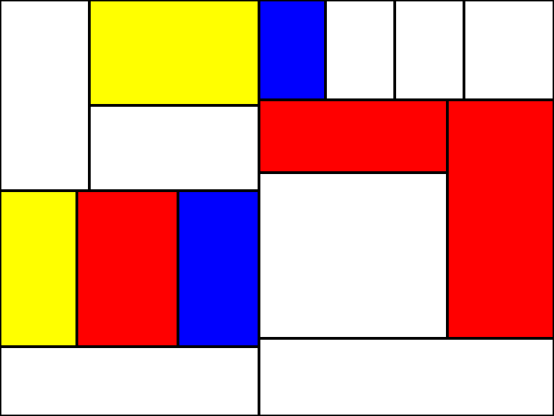

# Procedural art with JavaScript

> Time you enjoy wasting isn't wasted time.

This repository contains some procedural art algorithms I like devising during my spare time. I don't use any external libraries and I rely on the HTML `<canvas>` element for rendering.

## 1 - Recursive polygons

[Blog post](https://maxhalford.github.io/blog/art-1/)

## 2 - Mondrian

## License

The MIT License (MIT). Please see the [license file](LICENSE) for more information.
