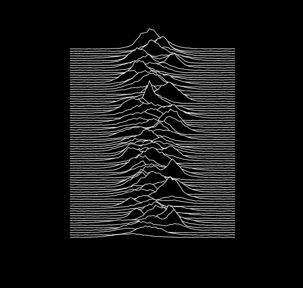
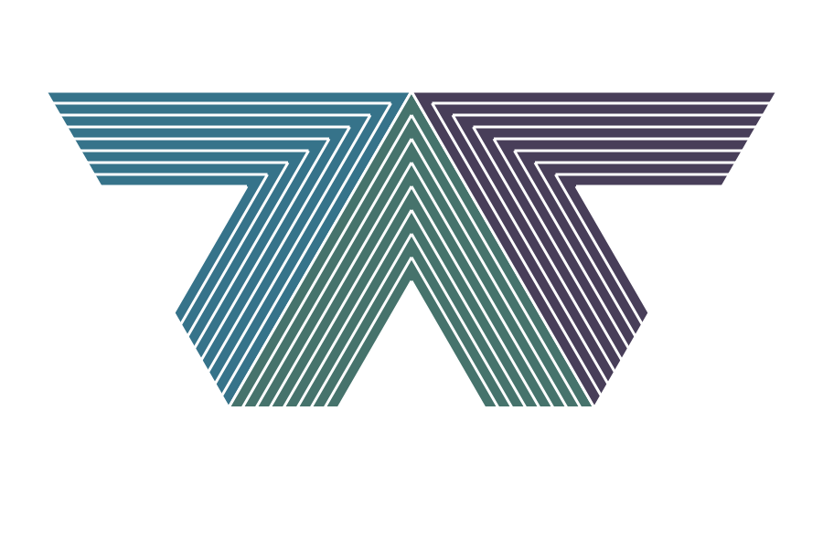
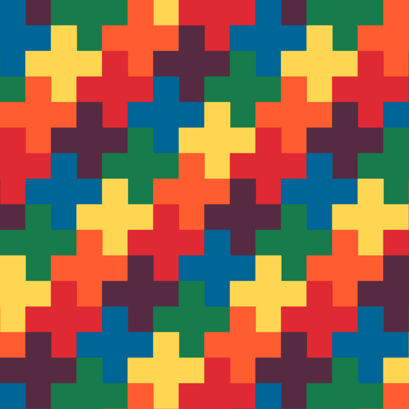

# Procedural art with JavaScript

> Time you enjoy wasting isn't wasted time.

This repository contains some procedural art algorithms I like devising during my spare time. I don't use any external libraries and I rely on the HTML `<canvas>` element for rendering. Every time you open of the `html` files it will generate a random image. Each art work has a write up which you can access by clicking on the section names.

## [1 - Recursive polygons](https://maxhalford.github.io/blog/recursive-polygons-with-javascript/)

    

## [2 - Mondrian](https://maxhalford.github.io/blog/grid-paintings-à-la-mondrian-with-javascript/)

    

## [3 - Unknown pleasures](https://maxhalford.github.io/blog/unknown-pleasures-with-javascript/)

    

## [4 - Stella triangles](https://maxhalford.github.io/blog/stella-triangles-with-javascript/)

    

## [5 - Morellet crosses](https://maxhalford.github.io/blog/morellet-crosses-with-javascript/)

    

## License

The MIT License (MIT). Please see the [license file](LICENSE) for more information.
